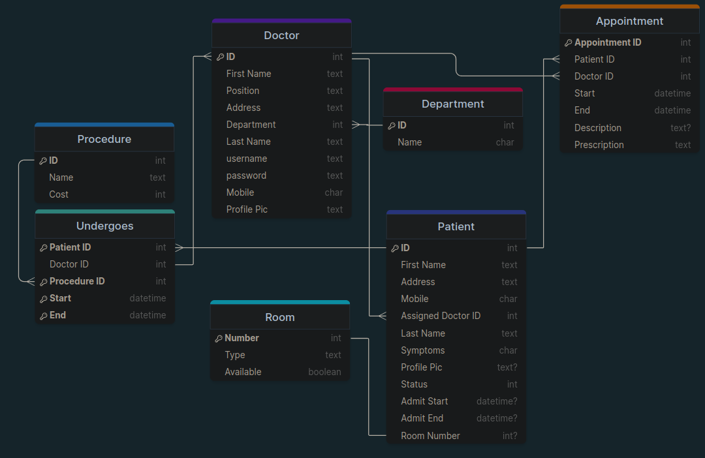

# Hospital Management System

Developed a robust hospital management platform using Django & MySQL with authentication mechanisms for doctors and patients.

## Features

* **Patient Management**: 
  * Front desk personnel can handle patient registration, admission, and discharge.
  * Patients can schedule either emergency or regular appointments with automated billing generation.

* **Doctor Management**: 
  * Doctors can retrieve patient records, manage prescriptions, and coordinate treatment plans, enhancing overall workflow.

## Tech Stack

* **Backend**: Django
* **Frontend**: HTML/CSS
* **Database**: MySQL

## Database Structure

